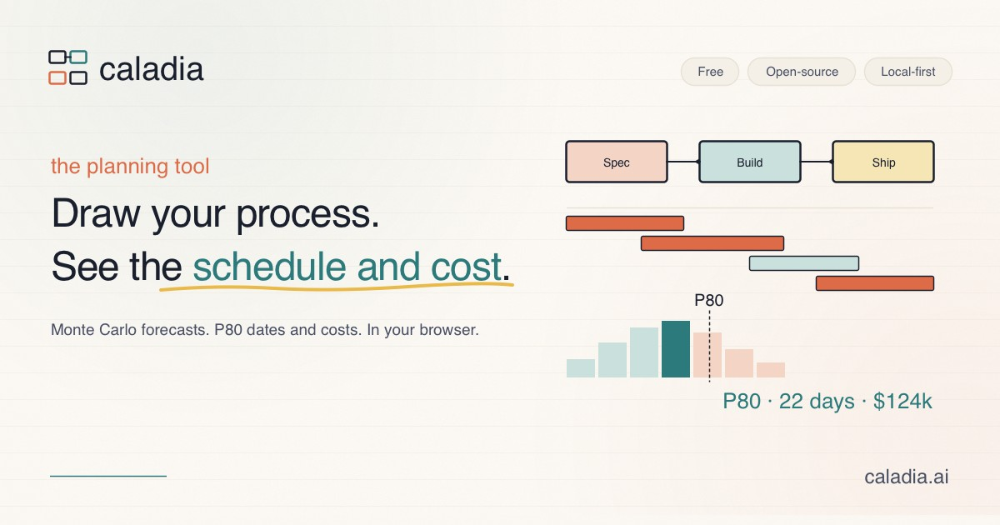
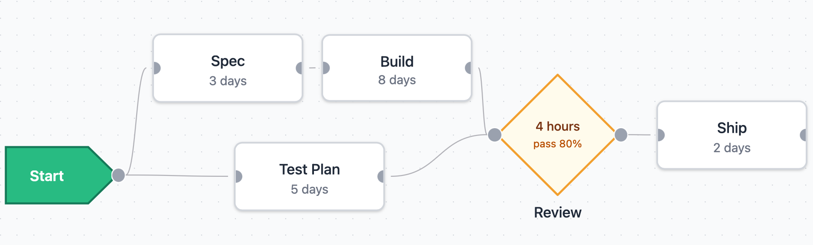
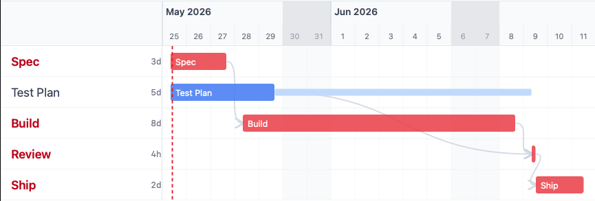
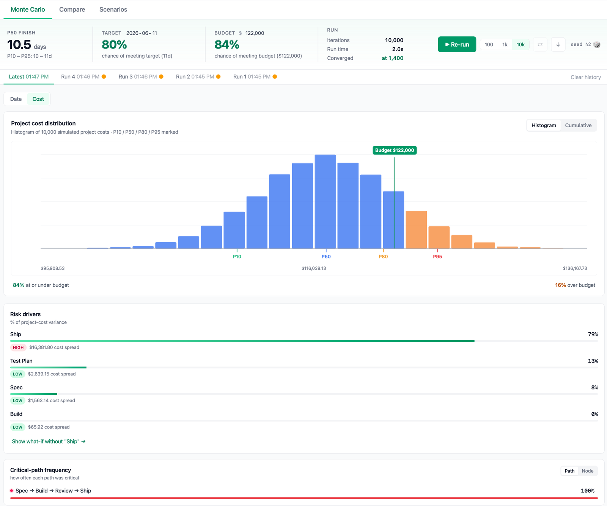

<h1 align="center">Caladia — Business Process Simulator</h1>

<p align="center">
  <picture></picture>
</p>

<p align="center">
  <a href="https://app.caladia.ai"></a>&nbsp;
  <a href="https://caladia.ai"></a>&nbsp;
  <a href="https://caladia.ai/docs/"></a>&nbsp;
  <picture></picture>&nbsp;
  <picture></picture>
</p>

<p align="center"><strong>An open-source, local business process simulator. Draw your process, see the schedule and cost, run Monte Carlo what-ifs — all in your browser.</strong></p>

<p align="center">No accounts. No backend. Everything runs in the browser and saves to your local files (<code>.cala</code>).</p>

---

<table align="center">
  <tr>
    <td align="center" width="50%">
      <picture></picture>
      <br/><sub><em>Draw the process</em></sub>
    </td>
    <td align="center" width="50%">
      <picture></picture>
      <br/><sub><em>See the schedule</em></sub>
    </td>
  </tr>
</table>

<p align="center">
  <picture></picture>
  <br/><sub><em>Monte Carlo simulation — percentiles, criticality, tornado, S-curve</em></sub>
</p>

---

## Features

- 📊 **Visual canvas → live Gantt** — Drag-and-drop block diagram with FS/SS/FF/SF dependencies; the Gantt re-renders live.
- 💾 **Local-first** — Runs in your browser, saves to `.cala` files, IndexedDB autosaves as a safety net.
- 🚦 **Decision gates** — Review/quality-gate nodes with a pass probability and a failure-delay penalty.
- 🔁 **Loop construct** — Wrap nodes into iterative loops with kickout conditions and samplable iteration counts.
- 📅 **Resources with calendars** — Resource pools with working calendars, hourly rates, and utilisation histograms.
- 🎲 **Monte Carlo simulation** — Seeded runs producing percentile finish dates and costs, criticality, tornado, and S-curve.
- 🔀 **Scenario comparison** — Named what-if branches with side-by-side diffs against the baseline.
- 💰 **Cost modelling** — Hourly rates, per-use charges, fixed costs — Monte Carlo on cost as well as dates.
- 🤖 **AI-guided import** — MS Project XML, Excel Gantt, or PowerPoint → draft + an LLM cleanup prompt.

<details>
<summary><strong>Full feature list</strong></summary>

- **Swimlane groups** — Tag nodes and loops with named groups. Toggle a colour overlay on the canvas to see them at a glance.
- **Sub-system blocks** — Wrap a group of nodes into a single container. It shows as one block on the parent canvas; double-click to drill in. Sub-systems flatten before CPM so scheduling is unchanged. Export and import as standalone `.calasub` files with provenance (filename, content hash, import time).
- **Currency display** — Projects pin a base currency and an FX snapshot at save time. Pick any display target in Settings and totals render as `$26,000 USD / ≈€22,211 EUR`. FX snapshots ship with the build — never fetched at runtime; a banner offers to re-pin when a newer one is available.
- **Diagram-health indicator** — A small `● N nodes` pill in the Toolbar turns green → amber → red as the diagram grows, with a hint to split into sub-systems once it gets unwieldy.
- **Headless CLI** — The `caladia simulate` CLI (`@procsim/cli`) runs Monte Carlo against a `.cala` file and emits the same JSON the in-app exporter produces. Use it for batch runs, CI, or scripted scenario sweeps.
- **Free-floating comments** — Drop text annotations anywhere on the canvas, independent of nodes. Selectable, draggable, keyboard-deletable. Placement opens the comment for editing; reload doesn't, so a stale empty comment can't steal focus.
- **Multi-node alignment + distribute** — Select two or more nodes and the floating toolbar offers align (Left / Centre / Right / Top / Middle / Bottom) and distribute. Already-aligned selections are a no-op — no phantom undo step.
- **Snap-to-grid** — Toggleable 16 px grid. Drag-end and placement-click both snap to it. The dot background marks the grid so what you see is where things land.
- **Wire-on-place** — While placing a node, hover over an existing node's source handle to arm a ghost connection. Click commits the new node and every armed wire in one undo step. Esc pops one wire at a time before falling through to cancel.
- **Keyboard shortcuts** — `A` / `D` / `S` / `E` enter placement for activity / decision / start / end nodes. `C` drops a comment, `L` wraps the selection as a loop, `G` as a sub-system, `P` opens the resource palette. Arrow keys nudge the placement ghost. Standard ⌘/Ctrl+Z, ⌘/Ctrl+C/V, ⌘/Ctrl+S to save, Delete, and Space-to-fit.

</details>

---

## Running simulations from the command line

The `caladia` binary in `@procsim/cli` runs Monte Carlo against a `.cala` file headlessly — useful for batch runs, CI, or scripted scenario sweeps. The JSON it writes is byte-identical to the in-app exporter at the same seed.

```bash
# One-time: install dependencies and build the workspace
pnpm install && pnpm -r build

# Run a simulation
node packages/cli/dist/index.js simulate path/to/plan.cala \
  --iters 10000 \
  --seed 42 \
  --out result.json
```

Or link the binary globally and invoke it directly:

```bash
pnpm --filter @procsim/cli link --global    # one-time
caladia simulate path/to/plan.cala --iters 10000 --seed 42 --out result.json
```

---

## Architecture

Eight packages in strict dependency order:

```
file-format → calendar → scheduler → simulation ─┬─→ engine-worker → app ← importers
                                                 └─→ cli
```

- **`file-format`** — Zod schema (source of truth for all types), file I/O, holiday presets, `.calasub` sub-system file format
- **`calendar`** — working-time arithmetic (calendar-aware date math)
- **`scheduler`** — CPM engine: FS/SS/FF/SF dependencies, calendar-aware, loop constructs via two-pass scheduling, sub-system flattening pre-pass
- **`simulation`** — Monte Carlo with seeded hierarchical per-node RNG (`pure-rand`)
- **`engine-worker`** — persistent Web Worker wrapper; `scheduleAsync` / `simulateAsync` with progress callbacks and AbortSignal cancellation
- **`importers`** — pure browser-safe parsers: MS Project XML, Excel Gantt (tabular + visual), PPTX diagrams → `ImportDraft` + `AmbiguityList`
- **`cli`** — headless Node CLI (`caladia simulate`) that runs Monte Carlo against a `.cala` file and writes the same JSON the in-app exporter produces
- **`app`** — Vite + React + React Flow + Tailwind UI; imports from `engine-worker` and `importers`

Core packages are pure and framework-free — no React, no DOM, no `Date.now()` or `Math.random()` inside computation. See [`ARCHITECTURE.md`](ARCHITECTURE.md) for patterns and design decisions.

---

## File formats

Projects are saved as `.cala` files (JSON, MIME `application/json`). The schema is versioned, so old files keep loading via migration — see `packages/file-format/src/schema.ts` for the Zod definition (the source of truth for all types).

| Extension  | Description                                                                                                                                                                                                                                                                             |
| ---------- | --------------------------------------------------------------------------------------------------------------------------------------------------------------------------------------------------------------------------------------------------------------------------------------- |
| `.cala`    | Project file. Contains nodes, edges, loops, calendars, resources, scenarios, sub-systems, free-floating comments, plus project currency / pinned FX snapshot / optional budget for cost modelling. Sub-systems carry auto-injected structural entry/exit port nodes since V7. |
| `.procsim` | Legacy project file. Still loads cleanly; migrated forward through V1→V2→…→V7 and saved back as `.cala`.                                                                                                                                                                 |
| `.calasub` | Stand-alone sub-system file. Contains the body nodes/edges/loops plus the calendars and resources they reference, plus the structural port nodes since v4.                                                                                                                    |

---

## Contributing

Issues and PRs welcome. For substantial changes, open an issue first to discuss the approach. See [CONTRIBUTING.md](CONTRIBUTING.md) for the dev setup and the standard `build` / `test` / `typecheck` commands.

---

## License

MIT
